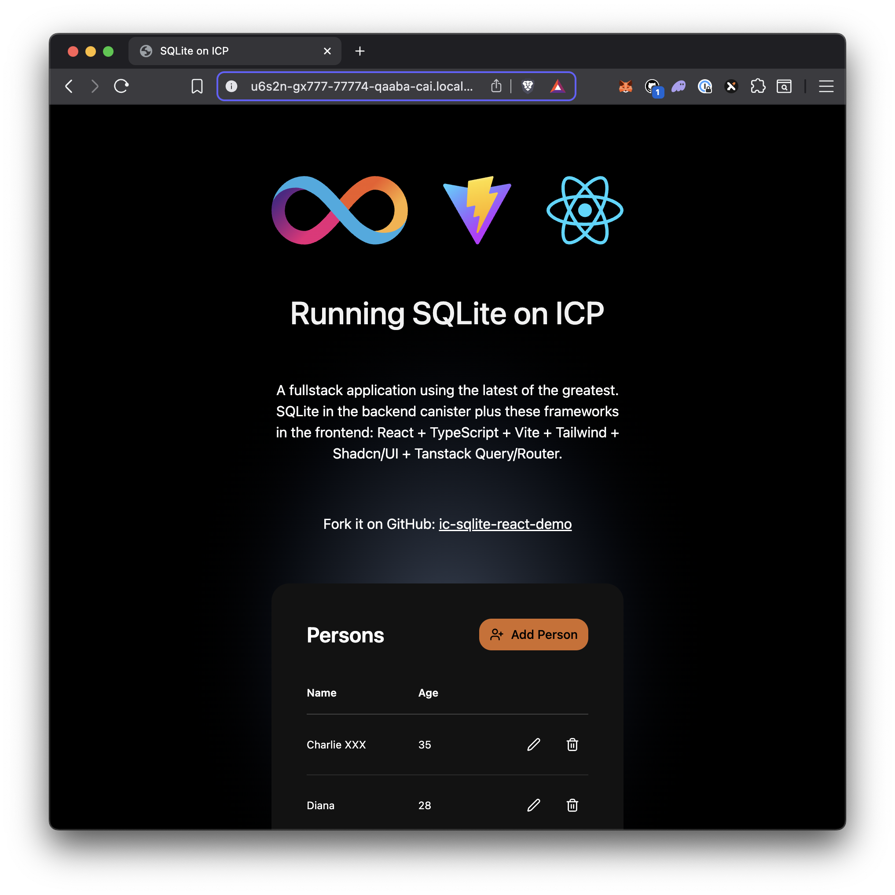

# ICP + SQLite + React + TypeScript + Vite + Tailwind + Shadcn/UI + Tanstack Query/Router

This template provides a batteries-included, production-ready example of a full-stack Internet Computer application with SQLite persistence. It demonstrates proper architecture patterns for building CRUD applications on the ICP, including database migrations, three-layer validation, and clean separation of concerns.

## What This Template Provides

- **Complete CRUD Example**: A working person management system with Create, Read, Update, and Delete operations
- **SQLite Integration**: Shows how to properly integrate SQLite into a Rust-based Internet Computer canister
- **Best Practices**: Demonstrates manager/controller patterns, input validation at multiple layers, and type-safe development
- **AI-Ready Development**: Includes an `agents.md` file to help LLMs understand and work with your project effectively

> [!TIP]
> **Getting Started with This Template**
>
> 1. Fork this repository as a starting point for your ICP + SQLite project
> 2. Review the `agents.md` file to understand the project structure
> 3. Share the `agents.md` file with your LLM for AI-assisted development
> 4. Replace the Person entity with your own data models
>
> Live demo: <https://ml463-eyaaa-aaaai-q33mq-cai.icp0.io>

[![Forks][forks-shield]][forks-url]
[![Stargazers][stars-shield]][stars-url]
[![Issues][issues-shield]][issues-url]
[![MIT License][license-shield]](LICENSE)



## Features

### Example Application: Person Management CRUD

This template includes a fully functional person management system that demonstrates:
- **Create**: Add new persons with name and optional age
- **Read**: List all persons with pagination support
- **Update**: Modify existing person records
- **Delete**: Remove persons from the database
- **Count**: Get total number of records for pagination

### Backend Architecture

The Rust-based backend showcases:
- **SQLite Integration**: Persistent data storage within the canister using [`ic-rusqlite`](https://github.com/wasm-forge/ic-rusqlite)
- **Database Migrations**: Automatic schema setup on canister initialization
- **Manager Pattern**: Static methods for all database operations
- **Controller Pattern**: Clean separation between IC endpoints and business logic
- **Three-Layer Validation**:
  1. SQL constraints at the database level
  2. Rust new types for type-safe validation
  3. Frontend form validation for immediate user feedback
- **Automatic Candid Generation**: Interface definitions extracted from Rust code

### Frontend Stack

The React/TypeScript frontend demonstrates:
- **Tanstack Query**: Data fetching with caching and optimistic updates
- **Tanstack Router**: Type-safe routing
- **Form Handling**: Input validation and error display
- **Responsive UI**: Built with Tailwind CSS 4 and shadcn/ui components

### Key Technologies

- [React 19](https://react.dev): The long awaited upgrade brings form actions, optimistic UI updates while mutating, etc etc.
- [Vite 6](https://vite.dev/): The most significant major release since Vite 2, featuring a new Environment API for enhanced flexibility, extended framework support, and streamlined performance for modern web development.
- [Tailwind 4](https://tailwindcss.com/docs/v4-beta): The new version of Tailwind CSS is a ground-up rewrite of the framework, providing faster builds, great new CSS classes and better performance.
- [Tanstack Query 5](https://tanstack.com/query/latest): The template uses Tanstack Query for data fetching, caching and loading state management.
- [Tanstack Router](https://tanstack.com/router/latest): Modern and scalable routing for React and Solid applications
- [SWC](https://swc.rs/): The Rust based compiler and bundler that provides up to 70x faster build times than Babel.
- [Eslint 9](https://eslint.org/): The latest release of Eslint introduces the flat configuration API along with new rules and bug fixes.
- [shadcn/ui](https://ui.shadcn.com/): Yes, shadcn support for Tailwind 4 is finally here!

## Why Use This Template?

This template is ideal if you want to:
- Build a data-driven application on the Internet Computer
- Learn how to properly integrate SQLite with IC canisters
- Understand best practices for validation and error handling
- See a real-world example of manager/controller patterns in Rust
- Get started quickly with AI-assisted development using the included `agents.md` file

## Setup & Development

Pre-requisites:

- [Local Internet Computer dev environment](https://internetcomputer.org/docs/current/developer-docs/backend/rust/dev-env)
- [pnpm](https://pnpm.io/installation)
- Rust toolchain 
- [wasi2ic](https://github.com/wasm-forge/wasi2ic) 

## Running the project

### 1. Start the Internet Computer

```bash
dfx start --background
```

### 2. Install dependencies

```
pnpm install
```

### 3. Deploy the canisters

```
dfx deploy
```

## Develop

During development, you can run the frontend with hot reloading using Vite.

```bash
pnpm run dev
```

## License

This project is licensed under the MIT License. See the LICENSE file for more
details.

## Contributing

Contributions are welcome! Please open an issue or submit a pull request if you
have any suggestions or improvements.

[forks-shield]: https://img.shields.io/github/forks/kristoferlund/ic-sqlite-react-demo.svg?style=for-the-badge
[forks-url]: https://github.com/kristoferlund/ic-sqlite-react-demo/network/members
[stars-shield]: https://img.shields.io/github/stars/kristoferlund/ic-sqlite-react-demo?style=for-the-badge
[stars-url]: https://github.com/kristoferlund/ic-sqlite-react-demo/stargazers
[issues-shield]: https://img.shields.io/github/issues/kristoferlund/ic-sqlite-react-demo.svg?style=for-the-badge
[issues-url]: https://github.com/kristoferlund/ic-sqlite-react-demo/issues
[license-shield]: https://img.shields.io/github/license/kristoferlund/ic-sqlite-react-demo.svg?style=for-the-badge
